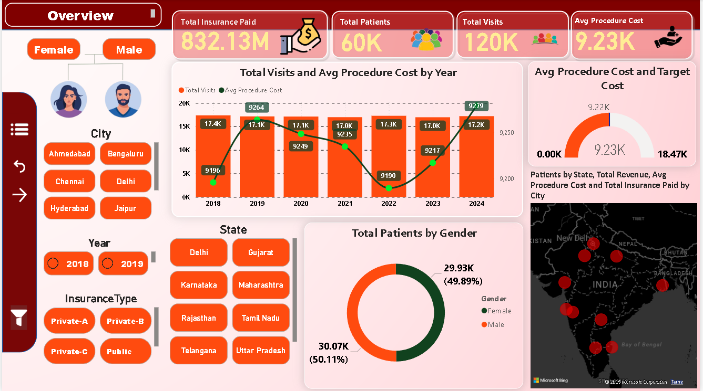
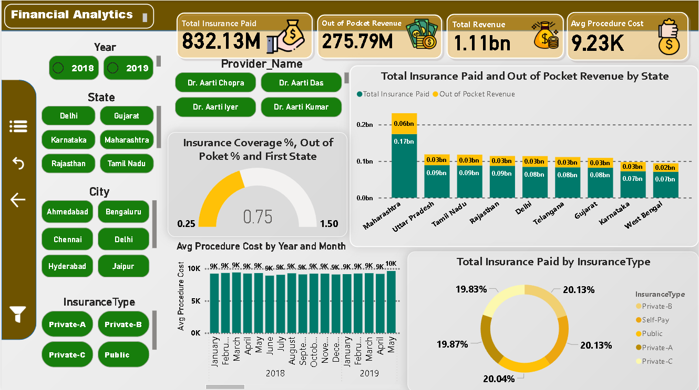
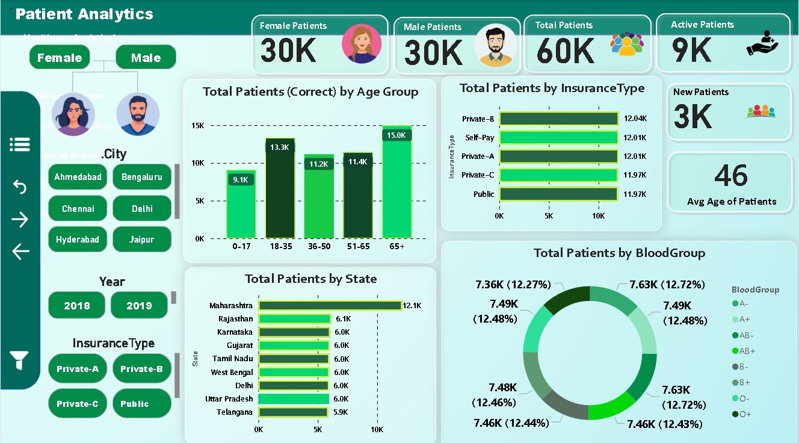
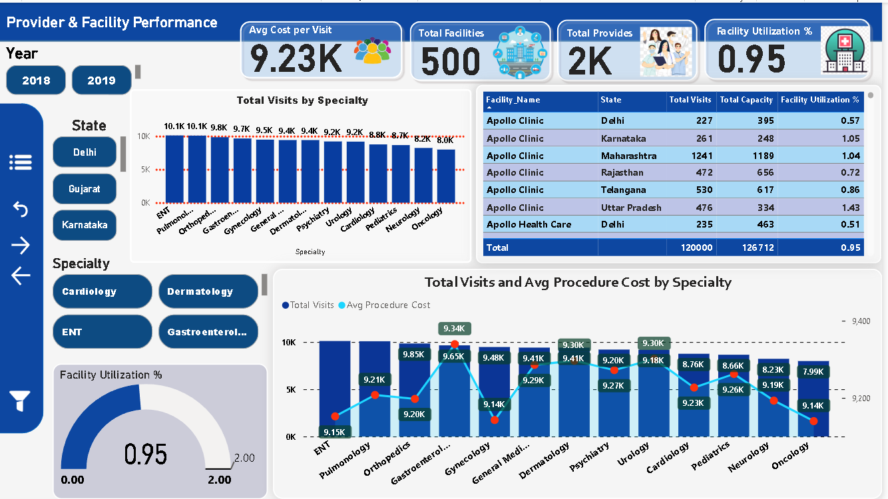
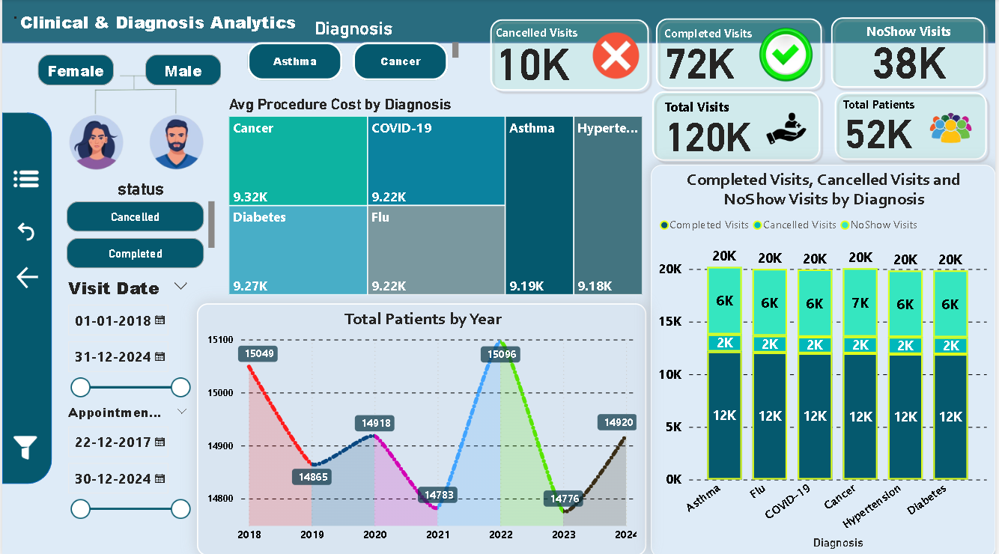
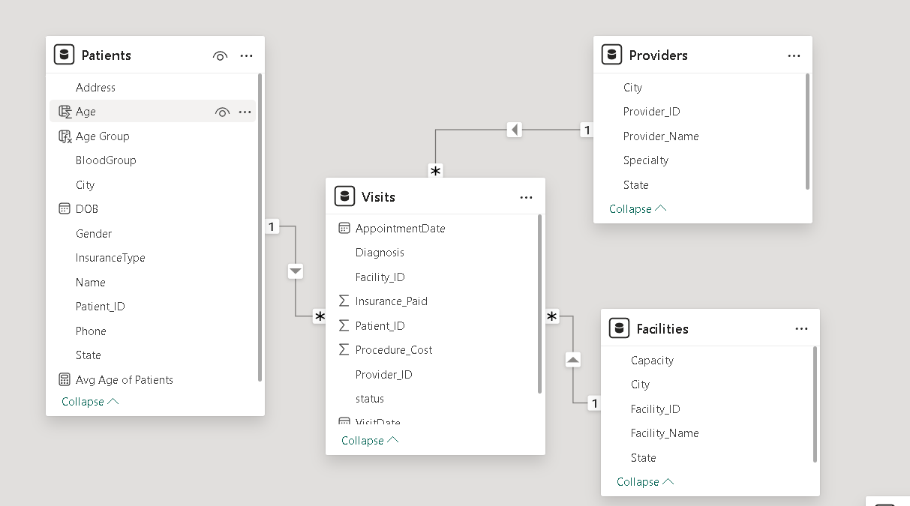

# 🏥 Healthcare Revenue & Patient Analytics Dashboard  
### End-to-End Healthcare Analytics Project | Power BI + SQL + Python

  

---

# 📌 Project Overview

This project is a complete end-to-end **Healthcare Analytics & Revenue Intelligence Dashboard** developed using **Power BI, SQL, and Python** to analyze patient behavior, hospital revenue, insurance coverage, provider performance, facility utilization, and clinical operations using a multi-table healthcare dataset.

The dashboard simulates a real-world healthcare analytics environment used by hospitals, clinics, insurance providers, and healthcare management teams to monitor operational performance, patient trends, financial metrics, and treatment efficiency.

The project transforms raw healthcare transactional data into actionable insights for healthcare administrators, finance teams, and operational stakeholders. Inspired by modern healthcare dashboarding and KPI reporting approaches. :contentReference[oaicite:0]{index=0}

---

# 🎯 Business Objective

The primary objective of this project was to help healthcare stakeholders answer critical operational and financial questions such as:

- How much revenue is generated through insurance and patient payments?
- Which states and cities generate the highest healthcare revenue?
- How efficiently are healthcare facilities utilized?
- Which providers and specialties handle the highest number of visits?
- How do diagnosis trends impact operational performance?
- What are the patient demographics across age groups and gender?
- Which insurance types contribute the highest revenue?
- How do cancelled, completed, and no-show visits impact hospital operations?

---

# 🛠 Tech Stack

| Tool / Technology | Purpose |
|---|---|
| SQL | Data Cleaning, KPI Validation & Healthcare Analysis |
| Python (Pandas, NumPy) | Data Preprocessing & Feature Engineering |
| Power BI | Interactive Dashboard Development |
| DAX | KPI Calculations & Time Intelligence |
| Power Query | Data Transformation |
| Star Schema Modeling | Scalable Data Modeling |

---

# 📂 Dataset Information

The project uses a multi-table healthcare dataset simulating hospital and patient management systems.

## Core Tables

| Table Name | Description |
|---|---|
| Patients | Patient demographic and insurance details |
| Visits | Appointment and treatment-level records |
| Providers | Doctor and specialty information |
| Facilities | Facility capacity and utilization data |

---

# 🧩 Data Modeling

A Star Schema data model was implemented for optimized analytics and scalable reporting.

## Fact Table

- `Visits`

## Dimension Tables

- `Patients`
- `Providers`
- `Facilities`

## Relationship Structure

- One-to-many relationships
- Patient-level visit tracking
- Provider-level operational analysis
- Facility utilization analysis
- Time-based healthcare reporting

This structure improves:

- Query performance
- Filter propagation
- DAX efficiency
- Dashboard scalability

Healthcare dashboards commonly rely on centralized KPI reporting and operational visibility for decision-making. :contentReference[oaicite:1]{index=1}

---

# 🧹 Data Cleaning & Preparation

Python and SQL were used for preprocessing and data quality validation.

## Cleaning Steps

- Removed duplicate records
- Handled missing values
- Fixed inconsistent data types
- Standardized diagnosis and insurance categories
- Created calculated healthcare KPIs
- Validated revenue and insurance calculations

---

# 🧠 SQL Analysis Performed

SQL was used for:

- Revenue analysis
- Insurance coverage calculations
- Provider performance tracking
- Patient segmentation
- Facility utilization reporting
- Diagnosis-level analysis
- Visit trend analysis
- KPI validation

---

# 📊 Key Metrics Tracked

- Total Revenue
- Insurance Paid Amount
- Out-of-Pocket Revenue
- Total Patients
- Total Visits
- Avg Procedure Cost
- Facility Utilization %
- Completed Visits
- Cancelled Visits
- No-Show Visits
- Avg Cost Per Visit

---

# 📈 Dashboard Pages

The project includes multiple business-focused Power BI dashboard pages.

---

# 1️⃣ Executive Overview Dashboard

Provides a high-level overview of healthcare operations and financial performance.

## KPIs Included

- Total Insurance Paid
- Total Revenue
- Total Patients
- Total Visits
- Avg Procedure Cost

## Key Insights

- Healthcare revenue exceeded **1.11 Billion**
- Insurance payments contributed the majority of revenue
- Average procedure cost remained stable around **9.23K**
- Male and female patient distribution remained balanced

---

# 2️⃣ Financial Analytics Dashboard

Focused on healthcare revenue and insurance analysis.

## Analysis Included

- Insurance revenue by state
- Out-of-pocket revenue analysis
- Insurance type contribution
- Procedure cost trends
- Provider-level financial analysis

## Key Insights

- Maharashtra generated the highest insurance revenue
- Insurance-covered payments significantly exceeded out-of-pocket payments
- Revenue distribution across insurance types remained balanced
- Avg procedure costs remained relatively stable across periods

---

# 3️⃣ Patient Analytics Dashboard

Focused on patient demographics and healthcare segmentation.

## Analysis Included

- Age group distribution
- Insurance type distribution
- Blood group analysis
- State-wise patient distribution
- Active vs new patient tracking

## Key Insights

- Age group **65+** represented the largest patient segment
- Patient distribution across insurance types remained balanced
- Maharashtra showed the highest patient count
- Blood group distribution remained relatively even

---

# 4️⃣ Provider & Facility Performance Dashboard

Focused on operational efficiency and provider performance.

## Analysis Included

- Facility utilization tracking
- Provider specialty performance
- Avg cost per visit
- Facility capacity analysis
- Specialty-wise visit analysis

## Key Insights

- Facility utilization remained near optimal levels
- ENT and Pulmonology specialties recorded high visit counts
- Avg cost per visit remained stable across specialties
- Some facilities exceeded utilization capacity

---

# 5️⃣ Clinical & Diagnosis Analytics Dashboard

Focused on diagnosis trends and appointment outcomes.

## Analysis Included

- Diagnosis-level procedure cost
- Completed vs cancelled visits
- No-show analysis
- Patient trends by year
- Diagnosis performance comparison

## Key Insights

- Completed visits significantly exceeded cancelled visits
- Cancer-related procedures showed the highest average procedure cost
- No-show visits represented a major operational inefficiency
- Patient visit trends remained relatively stable across years

---

# ⚡ Advanced Power BI Features

## Implemented Features

- Dynamic KPI Cards
- Interactive Slicers
- Multi-Page Navigation
- Drill-Down Analysis
- Drill-Through Navigation
- Dynamic Filtering
- KPI Benchmarking
- Time Intelligence Analysis
- Conditional Formatting
- Custom Dashboard Design
- Interactive Maps
- Business Storytelling Visuals

---

# 💼 Business Impact

This dashboard helps healthcare stakeholders:

- Monitor hospital revenue performance
- Track patient growth and operational efficiency
- Analyze insurance coverage trends
- Optimize provider and facility utilization
- Identify diagnosis-level cost patterns
- Improve appointment management
- Reduce operational inefficiencies
- Support data-driven healthcare decisions

Healthcare dashboards are increasingly used to improve operational visibility and healthcare decision-making. :contentReference[oaicite:2]{index=2}

---

# 🚀 Strategic Recommendations

# 1️⃣ Reduce No-Show & Cancelled Visits

Cancelled and no-show visits create operational inefficiencies.

## Recommended Actions

- Appointment reminder systems
- SMS & email notifications
- Patient engagement workflows
- Automated scheduling optimization

---

# 2️⃣ Optimize Facility Utilization

Some facilities exceed operational capacity.

## Recommended Actions

- Improve appointment balancing
- Optimize provider scheduling
- Expand high-demand facilities
- Monitor utilization thresholds

---

# 3️⃣ Improve High-Cost Diagnosis Management

Certain diagnoses generate significantly higher procedure costs.

## Recommended Actions

- Optimize treatment workflows
- Improve early diagnosis programs
- Monitor diagnosis-level profitability

---

# 4️⃣ Strengthen Insurance Revenue Strategy

Insurance contributes the majority of revenue.

## Recommended Actions

- Improve insurance claim processing
- Expand insurer partnerships
- Monitor reimbursement efficiency

---

# 5️⃣ Enhance Patient Retention & Experience

Balanced demographics indicate long-term patient potential.

## Recommended Actions

- Personalized patient engagement
- Faster appointment scheduling
- Improved follow-up processes

---

# 🔑 Key Skills Demonstrated

- Healthcare Analytics
- Revenue Analytics
- Patient Analytics
- SQL Analysis
- Power BI Dashboarding
- DAX Calculations
- KPI Development
- Facility Utilization Analysis
- Insurance Analytics
- Clinical Analytics
- Data Modeling
- Data Cleaning
- Business Intelligence
- Data Storytelling

---

# 📸 Dashboard Preview

## 🔹 Executive Overview Dashboard

  

---

## 🔹 Financial Analytics Dashboard

  

---

## 🔹 Patient Analytics Dashboard

  

---

## 🔹 Provider & Facility Performance Dashboard

  

---

## 🔹 Clinical & Diagnosis Analytics Dashboard

  

---

## 🔹 Data Model

  

---

# 👨‍💻 Author

## Ankit Kumar  
Aspiring Data Analyst | Power BI | SQL | Python | Healthcare Analytics

- GitHub: https://github.com/ankitkumargaya
- LinkedIn: https://www.linkedin.com/in/ankit5517

---

# 📌 Final Conclusion

This project demonstrates how healthcare operational and financial data can be transformed into a scalable business intelligence solution using Power BI, SQL, and Python.

The dashboard provides visibility into:

- Revenue performance
- Insurance analytics
- Patient demographics
- Clinical operations
- Facility utilization
- Provider efficiency
- Appointment management

This project reflects practical analytics skills commonly used in real-world healthcare analytics, hospital operations, and healthcare business intelligence environments.
